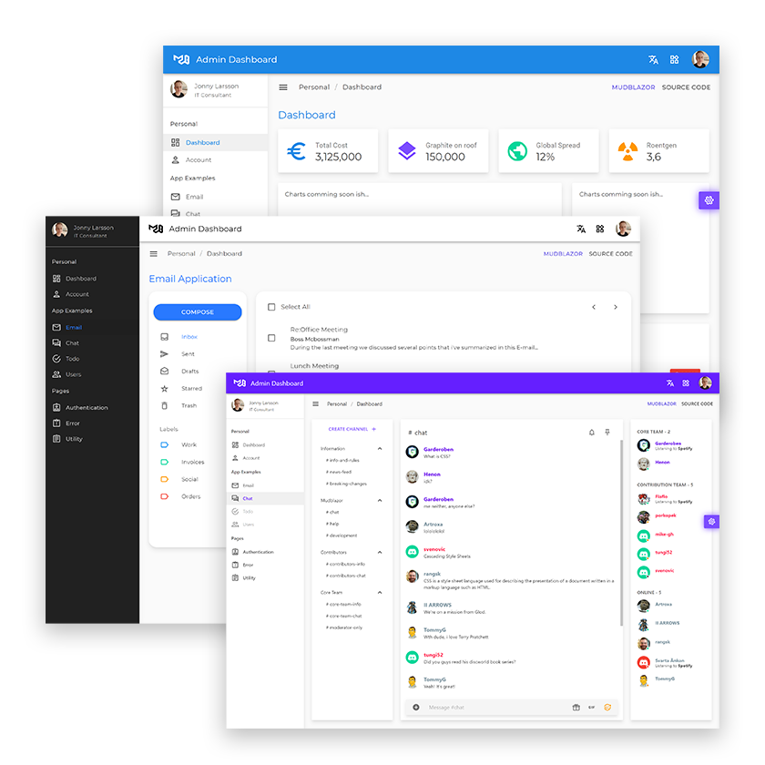

# 
# Blazor Project Templates built with MudBlazor

In this repo you will find project templates for Blazor built with just MudBlazor. The idea is to provide templates that range from a basic layout to more advanced application setups. It's an excellent place to get started with MudBlazor.

[Live demo](https://templates.mudblazor.com/)

**Note: Make sure to upgrade the MudBlazor nuget references to the newest version!** If you can, please PR the nuget upgrade, so this repo is kept up to date with MudBlazor.

## Prerequisites

- .NET 5
- Visual Studio 2019 with the ASP.NET and Web development.

## MudBlazor
For more information about Mudblazor, stop by our main repo or visit our website.
- [Github repository](https://github.com/Garderoben/MudBlazor)
- [MudBlazor website](https://mudblazor.com)

## Default Blazor Template

## Admin Dashboard Template

## License

These Templates are free to use!
